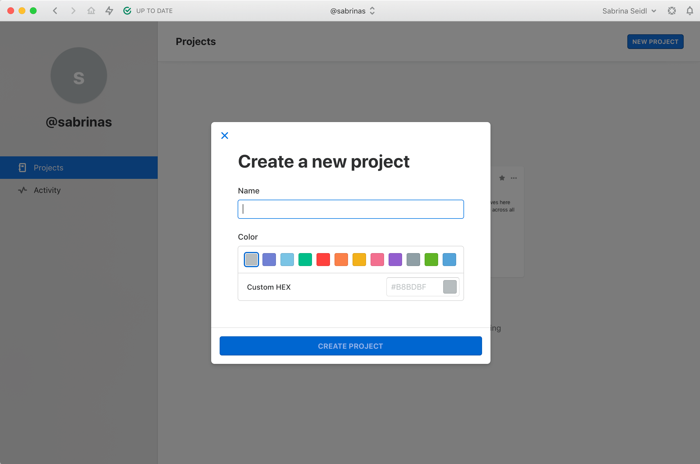
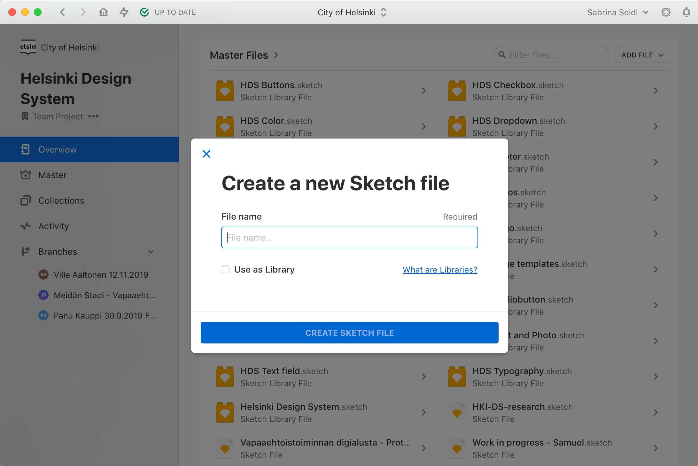
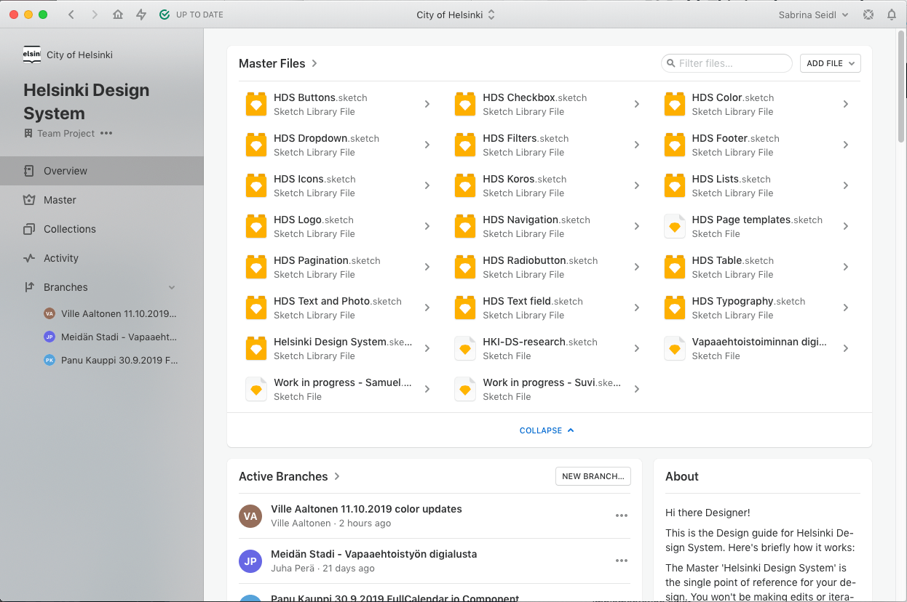
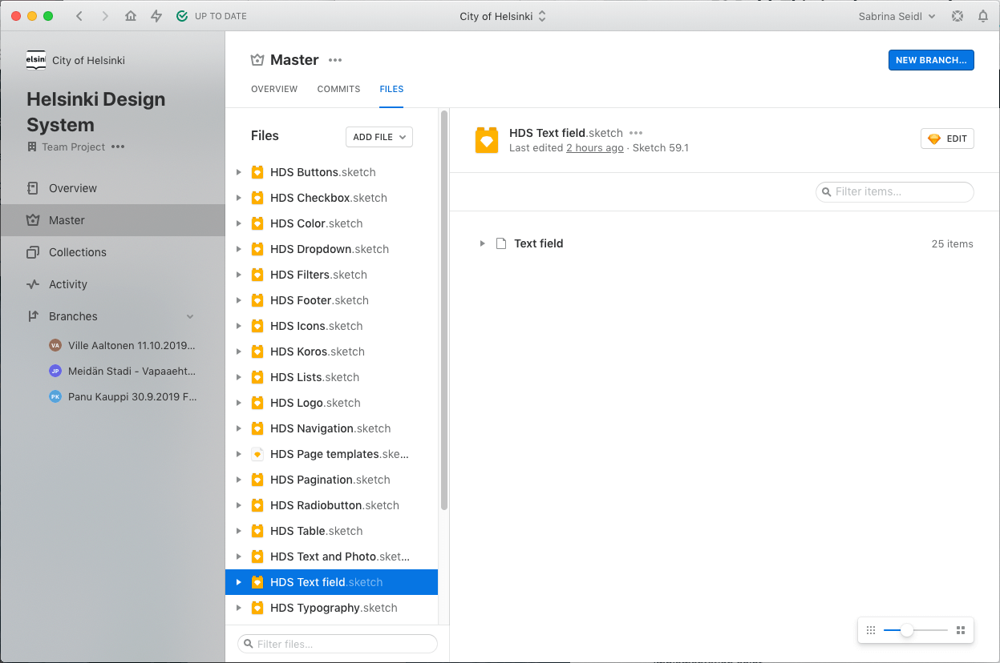
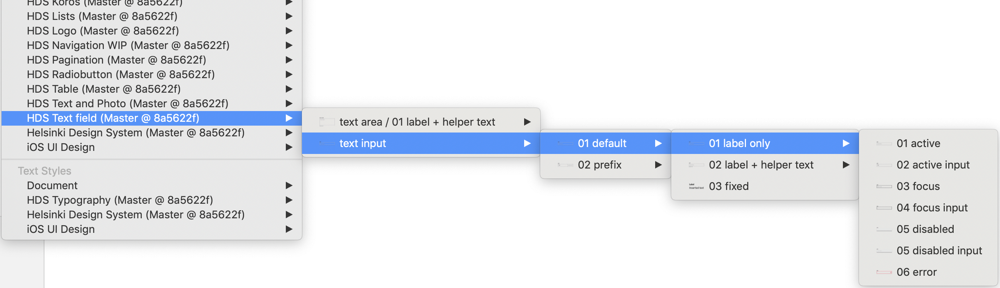
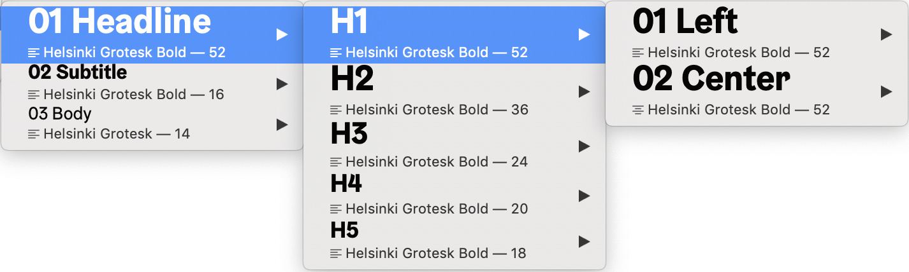

# For Designers

---

Rapidly build beautiful and accessible experiences. The HDS kit contains all the resources you need to get started.

The Master libraries of 'Helsinki Design System' are the single point of reference for your design. When you connect your design files with the design system libraries, you can use ready designed components and have them synced whenever the design system is updated.

## Getting started

**Start** with the following:

1. Explore the guidelines to learn the Helsinki City product design patterns and principles.
2. Take a look at the Components section, to see what’s there and how you can incorporate those into your designs.
3. To start taking those into use, go to Abstract, set up your project and link the desired HDS library files (Helsinki Design System) to your project and sketch file.
4. If you have a component that isn’t yet part of the Design System, propose it to the HDS team via a ‘review request’. The Lead Designer will review the design and also present it to the CXO (Jukka) and the brand manager (Hannamari). When Lead Designer approves the design, add your design to the library. Afterwards, communicate with the developers of your team about developing the component.

## Design principles

We always keep the core principles in mind, when making design decisions. We encourage you to follow the same principles.

- **Modular and flexible:** All components are designed to work seamlessly with one another and help people work smarter, better and faster.
- **Consistent:** All components are designed to work together to ensure consistent and cohesive user experience.
- **Accessibility baked-in:** Accessibility is part of the process from start to end. It is designed to be accessible to all, regardless of ability or situation.

## Tools

Workflow with _Sketch + Abstract_:

Sketch is a vector graphics editor and is widely adopted by designers across the globe to create user interface designs for web and mobile services.

Abstract enables designers to reliably version and manage their Sketch files. By leveraging and extends the technology of Git, Abstract provides design teams with a lightweight workflow and stable tools so designers can work together with confidence.

## Setting up

You will need to install Sketch and Abstract software.

To edit Sketch design files in Abstract, you’ll need to download the Sketch software (link here) and the Abstract software (link here). Even though Abstract has a web application, It’s not possible to edit or create Sketch files with it. It is possible for your team members to view your designs and provide feedback.

**Install fonts**

Make sure that you have the Helsinki Grotesk font installed.

**Create a project in Abstract**

You either need permission rights to create a new project in City of Helsinki organization, or you need an invite to a created project in this organization.

(Details about the permission rights here?)

**Create a Sketch file**

Once you’ve opened a project, click _Master_ on the left sidebar and choose _Add file > Create Sketch File_ from the view that open on the right. Now you can enter a name for the new Sketch file.

File naming should follow the naming convention below:

(Naming convention?)  
Example 1:  
Example 2:

Once finished, click _Create Sketch File_. Your new Sketch file will now appear in the _Files_ list of Abstract.

Once you have created your Sketch file in Abstract, always open your design file straight from Abstract. This way, all changes made to your file will be tracked and you have a version control over it.

**Link the design system libraries to your design file**

Open up any Branch within an Abstract Project and select the Files tab  
Select _Add File -> Link Library…_  
Select the _Helsinki Design System project_  
Select one or multiple Libraries and click _Link Libraries_

Once you link the Design System Library to your Project, your components are kept in sync with the Master library. When changes are made to the Master Library, you’ll have the option to update your symbols from Master via an alert in the top right for proper version control.

### Using library components

HDS components and icons live in the design kit as Sketch symbols.

**Library menu navigation**

There are two kinds of symbols — library symbols and document symbols. Library symbols are available in any Sketch document, while document symbols are specific to the document in which they are found.

From the Insert menu, select _Symbols → HDS [component name]_ to add symbols onto your page.

Helsinki Design System symbols are built to be flexible, and designers should not detach symbols from the library. Once a symbol is detached, you will no longer receive updates as they are released.

**Structure of the symbols (library components)**

Symbols are organised by component; after selecting a component, you’ll see the variations and states of that component.
To add the whole component, select the desired variant and place it on your Artboard (see image above).

_For even more configurability, use the individual building blocks found under the Items folder within the symbol. Be sure your custom design adheres to our design guidelines._

**Text styles**

**Library menu navigation**

From the main menu select _Insert → Text Styles → HDS Typography_ to insert a text style.  
Text styles within components are carefully considered. We do not recommend detaching the symbol to change default styles.

## More on Sketch

If you’re brand new to Sketch, they offer some great [tutorials and help docs](https://www.sketchapp.com/docs/).
