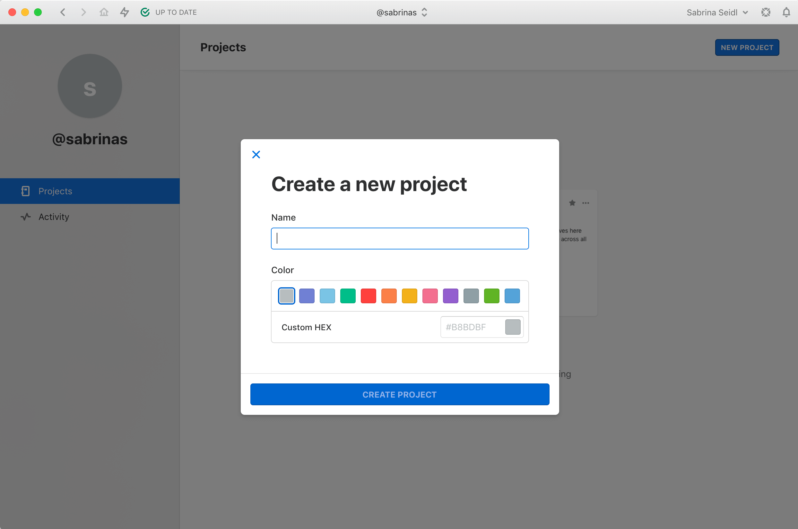
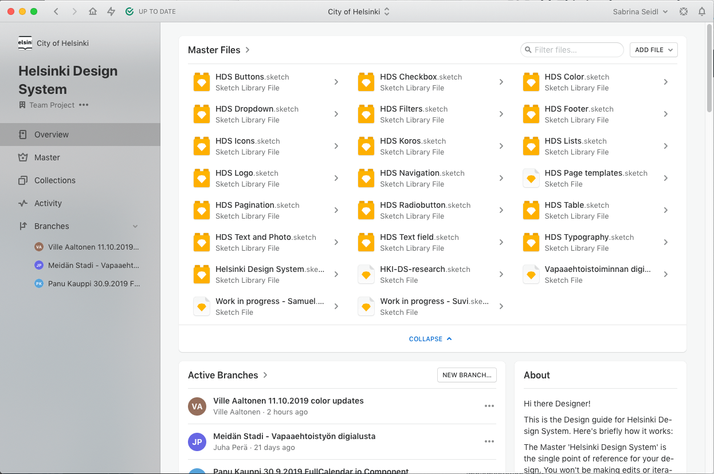

# For designers

---

import LargeParagraph from "../../src/components/LargeParagraph";

<LargeParagraph>The HDS design kit contains all the resources you need to get started designing beautiful and accessible user experiences, that follow the City of Helsinki brand.</LargeParagraph>

The HDS design libraries are the single point of reference for your design. When you connect your design files with the design system libraries, you can use ready designed components and have them synced whenever the design system is updated.

## Principles

Always keep these core principles in mind, when making design decisions:
- **Modular and flexible:** All components are designed to work seamlessly with one another and help people work smarter, better and faster.
- **Consistent:** All components are designed to work together to ensure consistent and cohesive user experience.
- **Accessibility baked-in:** Accessibility is part of the process from start to end. It is designed to be accessible to all, regardless of ability or situation.

## Getting started
1. Explore this Helsinki Design system documentation site, and the City of Helsinki [Visual Identity Guidelines](https://brand.hel.fi/ "City of Helsinki Visual Identity Guidelines") to learn the design principles and patterns.
2. Take a look at the Components section, to see what’s there and how you can incorporate those into your designs.
3. Install Sketch and Abstract apps.
4. To start taking components into use, go to Abstract, set up your project and link the desired HDS library files (Helsinki Design System) to your project and sketch file. The design assets are available in the publicly shared [Helsinki Design System library](https://share.goabstract.com/4be1120f-5c64-4937-9a56-0484b26e20d7).
5. If you have a an idea for improvements or a component that could be useful addition to the Design System, see the [Contributing](/contributing "Contributing") page for more information.

## Tools
The HDS design workflow is based on **Sketch** and **Abstract**:
- [Sketch](https://www.sketch.com/ "Sketch - The digital design toolkit") is a **vector graphics editor** and is widely adopted by designers to create user interface designs for web and mobile services.
- [Abstract](https://www.abstract.com/ "Abstract: Design Version Control, Collaboration & Handoff for teams") **design collaboration and version and managegement tool**, that enables designers to share Sketch files and libraries easily. By leveraging and extends the technology of Git, Abstract provides design teams with a lightweight workflow and stable tools so designers can work together with confidence.

If you’re a newcomer to Sketch or Abstract, they offer both some great tutorials and help docs
- [Sketch help docs](https://www.sketchapp.com/docs/ "Sketch help docs").
- [Abstract help docs](https://www.abstract.com/help/ "Abstract help docs").

## Setting up
### Install the tools
**To use HDS libraries, you will need to install both Sketch and Abstract**. Even though Abstract has a web application, It’s not possible to edit or create Sketch files with it. It is possible for your team members to view your designs and provide feedback.

### Install fonts
Make sure that you have the [Helsinki Grotesk](https://camelot-typefaces.com/helsinki-grotesk "Camelot Typefaces / Helsinki Grotesk") font installed.

Subcontractors can purchase the font licenses from [Camelot Typefaces website](https://camelot-typefaces.com/helsinki-grotesk "Camelot Typefaces / Helsinki Grotesk").

### Create a project in Abstract

You either need permission rights to create a new project in City of Helsinki organisation, or you need an invite to a created project in this organisation.

### Add a Sketch file to the project

Once you’ve opened a project in Abstract, click _Overview_ on the left sidebar. From the view that opens on the right, choose _Add file > Create Sketch File_. Now you can enter a name for the new Sketch file.

Once finished, click _Create Sketch File_. Your new Sketch file will now appear in the _Files_ list of Abstract.

Once you have created your Sketch file in Abstract, **always open your design file straight from Abstract**. This way, all changes made to your file will be tracked and you have a version control over it.

### Link the design system libraries to your design file

Open up a Branch within the Abstract Project. Select the _Files_ tab  
- From the top of the file list, select _Add File > Link Library…_  
- Select the _Helsinki Design System project_  
- Select one or multiple HDS Libraries and click _Link Libraries_

Once you link the Design System Library to your Project, your components are kept in sync with the Master library. When changes are made to the Master Library, you’ll have the option to update your symbols from Master via an alert in the top right for proper version control.

## Using

HDS components and icons live in the HDS libraries as Sketch symbols. 

There are two kinds of symbols in Sketch — **_library symbols_** and **_document symbols_**. _Library symbols_ are available in any Sketch document, while _document symbols_ are specific to the document in which they are found. 

The HDS component symbols are _library symbols_. **Do not detach symbols from the library.** Once a symbol is detached, you will no longer receive updates as they are released.

### Adding component symbols to layouts
Symbols are mainly organised into library files by component, exept form components (checkboxes, radio buttons, dropdowns and text fields), that are grouped into one library HDS Form Components file for convenience. 

**You can add symbols to your layout in two ways:**
1. from the _Insert_ menu, by selecting _Symbols > HDS [component name]_. After selecting a HDS component, you’ll see the variations and states of that component. Select the desired variant and place it on your artboard.

2. From the _Components_ tab in sidebar on the left, by selecting _HDS [component name]_. After selecting a HDS component, you’ll see the variations and states of that component. Select the desired variant from the sidebar, and drag it to your artboard. 

You can also select _All_ and filter the components list by component or variant name.

### Customising component symbols
The component symbols are use _smart layout_ for easy resizing. You can also configure the content and styling of symbol parts from the in the _Overrides_ section of symbol properties.

_When changing the colour or other styles of component symbols, be sure your custom design adheres to the design guidelines._ Styles within components are carefully considered. We do not recommend detaching the symbol to change default styles.

### Styling text elements
Linking the HDS Typography library to your project adds the possibility to give HDS text styles to your text elements. You can add text styles to your layout in two ways:

1. You can add a new text element with appropriate text style from the _Insert_ menu, by selecting _HDS Typograhy_ from the a text _Text styles_ section at the bottom part of the insert menu, selecting the desired text style and placing it on your artboard.

2. You can give text styles to existing text elements, by selecting the text element and changing its style from the _Appearance_ sidebar.

