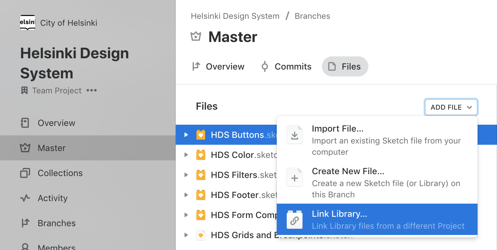
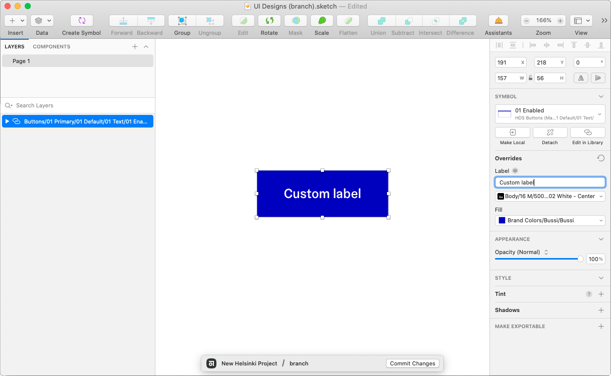
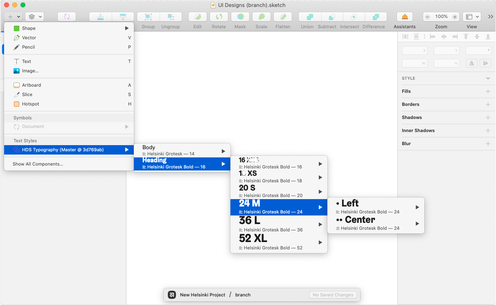
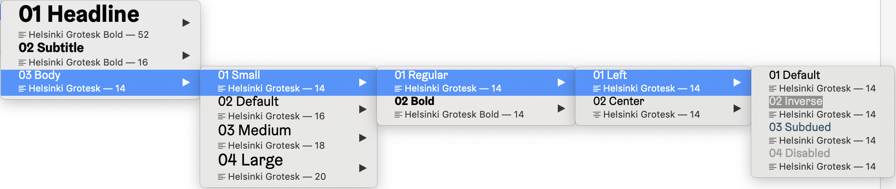
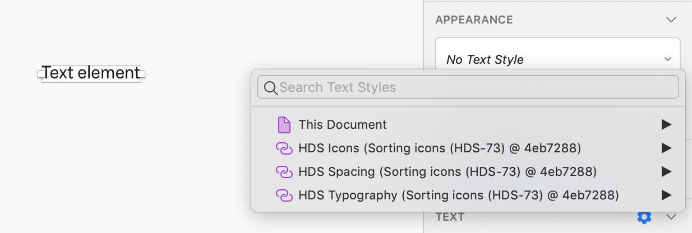

import LargeParagraph from "../../src/components/LargeParagraph";

# For designers

<LargeParagraph>
    The HDS design kit contains all the resources you need to get started designing beautiful and accessible user experiences that follow the City of Helsinki brand.
</LargeParagraph>

The HDS design libraries are the single point of reference for your design. When you connect your design files with the design system libraries, you can have the components synced whenever the design system is updated.

## Principles

Always keep these core principles in mind when making design decisions:
- **Modular and flexible:** All components are designed to work as reusable, customisable building blocks to help people work smarter, better and faster.
- **Consistent:** All components are designed to fit together seamlessly to ensure consistent and cohesive user experience.
- **Accessibility baked-in:** Accessibility is part of the process from start to end. It is designed to be accessible to all, regardless of ability or situation.

## Getting started
1. Explore the City of Helsinki [Visual Identity Guidelines](https://brand.hel.fi/ "City of Helsinki Visual Identity Guidelines") to learn the design principles of the brand.
2. Take a look at the [Components documentation](/components "Components") to see what’s there and how you can incorporate those into your designs.
3. The design assets are available either via direct design kit download or via the City of Helsinki Abstract. To use HDS libraries, you will need to install Sketch. See more on downloading and setting up the libraries below.
4. If you have an idea for improvements or a component that could be a useful addition to the Design System, see the [Contributing](/contributing "Contributing") page for more information.

## Setting up

### Install the tools
The HDS design workflow is based on **Sketch** and **Abstract** (if you have access to Helsinki organisation):
- [Sketch](https://www.sketch.com/ "Sketch - The digital design toolkit") is a **vector graphics editor** and is widely adopted by designers to create user interface designs for web and mobile services.
- [Abstract](https://www.abstract.com/ "Abstract: Design Version Control, Collaboration & Handoff for teams") **design collaboration and version and managegement tool** that enables designers to share Sketch files and libraries easily. By leveraging and extends the technology of Git, Abstract provides design teams with a lightweight workflow and stable tools so designers can work together with confidence.

If you are a newcomer to Sketch or Abstract, they both offer some great tutorials and help docs
- [Sketch help docs](https://www.sketchapp.com/docs/ "Sketch help docs")
- [Abstract help docs](https://www.abstract.com/help/ "Abstract help docs")

**You do not necessarily need Abstract to use HDS design libraries.** Abstract is a convenient way to get access and update Sketch libraires, but we also offer downloadable HDS design kit. Read below to learn how to download the design kit. 

### Install fonts
Make sure that you have the [Helsinki Grotesk](https://camelot-typefaces.com/helsinki-grotesk "Camelot Typefaces / Helsinki Grotesk") font installed.

Helsinki Grotesk font can be purchased from [Camelot Typefaces website](https://camelot-typefaces.com/helsinki-grotesk "Camelot Typefaces / Helsinki Grotesk").

### Import HDS libraries

You can start using the HDS design libraries to your project in two ways:

#### 1. Downloading HDS Design kit and linking libraries in Sketch
**This option gives you a stable version controlled package of all components released in the design system. ** You can choose what libraries you want to import, but we recommend importing all of them for best experience.

1. Head over to <a href="https://github.com/City-of-Helsinki/helsinki-design-system/releases" target="_blank" >HDS GitHub repository releases</a>.
2. Download `design-kit` (preferably the newest stable version) to your computer and unzip the package.
3. Open Sketch and from the top bar thoose _Sketch > Preferences_.
4. Choose tab _Libraries_ and press the button _Add library_.
5. Browse to the unzipped folder you just downloaded and select libraries you want to import. Note, you can select multiple libraries by holding shift key. 

#### 2. Linking libraries from Abstract
**This option keeps the components used in your designs in sync with the Master library.** When changes are made to the Master Library, you’ll have the option to update your symbols from Master via an alert in the top right corner in Sketch.

You will need permissions to access the City of Helsinki Abstract organisation for using libraries from Abstract.

**Note! Library versions in Abstract are considered development versions. They can change and things may be unstable.** Using libraries from Abstract allows you to get your hands also on the newest components that are not released yet. If you need more reliable libraries, follow the instructions of option 1. above to download latest stable [HDS design kit release](https://github.com/City-of-Helsinki/helsinki-design-system/releases).

1. In Abstract, open up a branch within the project you are working on. You'll either need an invite to a existing project in the City of Helsinki organisation, or permissions to create a new project. See [Abstract documentation](https://www.abstract.com/help/getting-started/ "Abstract / Getting started") for more information on joining organizations and starting projects.
2. From the top of the branch view, select the _Files_ tab
3. From the top of the file list, select _Add File > Link Library…_  
4. Select the _Helsinki Design System project_  
5. Select one or multiple HDS Libraries and click _Link Libraries_
6. Merge branch to the project master.

## Using libraries

HDS components and icons live in the HDS libraries as Sketch symbols. 

There are two kinds of symbols in Sketch — **_library symbols_** and **_document symbols_**. _Library symbols_ are available in any Sketch document, while _document symbols_ are specific to the document in which they are found. 

The HDS component symbols are _library symbols_. **Do not detach symbols from the library.** Once a symbol is detached, you will no longer receive updates as they are released.

### Adding component symbols to layouts
Symbols are mainly organised into library files by component, except form components (checkboxes, radio buttons, dropdowns and text fields), that are grouped into one library HDS Form Components file for convenience. 

**You can add symbols to your layout in two ways:**
1. From the _Insert_ menu, by selecting _Symbols > HDS [component name]_. After selecting a HDS component, you’ll see the variations and states of that component. Select the desired variant and place it on your artboard.

2. From the _Components_ tab in the sidebar on the left, by selecting _HDS [component name]_. After selecting a HDS component, you’ll see the variations and states of that component. Select the desired variant from the sidebar, and drag it to your artboard. 

You can also select _All_ and filter the components list by component or variant name.

### Customising component symbols
The component symbols use _smart layout_ for easy resizing. You can also configure the content and styling of symbol parts from the _Overrides_ section of symbol properties.

_When changing the colour or other styles of component symbols, be sure your custom design adheres to the design guidelines._ Styles within components are carefully considered. We do not recommend detaching the symbol to change default styles.

### Styling text elements
Linking the HDS Typography library to your project adds the possibility to give HDS text styles to your text elements. You can add text styles to your layout in two ways:

1. You can add a new text element with appropriate text style from the Insert menu: Select the HDS Typography from the Text styles section, choose the desired text style, and click anywhere on your artboard. This creates a new text element with the chosen style.

2. You can give text styles to existing text elements by selecting the text element and changing its style from the _Appearance_ sidebar.

