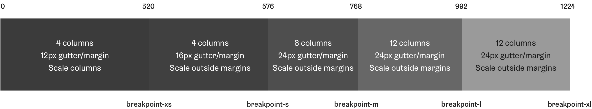

import LargeParagraph from "../../src/components/LargeParagraph";

# Grid

<LargeParagraph>
    Helsinki Design System follows a 12 column grid system which scales across five defined breakpoints. Using pre-defined grid system helps to keep visual consistency and rhythm across your designs and implementations.
</LargeParagraph>

> **Note!**
> 
> HDS does not currently include any implementation of the grid. Grid is provided as specified breakpoints and other values which can be easily applied to most commonly used grid systems.

## Principles

- HDS uses standard 12 column grid which maximum width is 1200 pixels. Container width and the amount of columns changes each breakpoint.
- Larger screen sizes use 24 pixel gutters while on mobile screen widths they shrink to 16 pixels and eventually to 12 pixels in the smallest breakpoint.
- Even though HDS does not include grid implementation, it recommends and suggests methods how to handle changing amount of columns and column stacking. See [Layout columns](/guidelines/grid#layout-columns) for more information.

## Grid behaviour

The following table presents how HDS grid behaves and changes in different breakpoints. Maximum container width, the number of columns and gutter size change between breakpoints. You can read more about breakpoint and container width tokens [here](/design-tokens/breakpoints#tokens).

Breakpoint token | Container-width token | # of columns | Margin (gutter) in px
-----------------|-----------------------|--------------|----------------------
--breakpoint-xs  | --container-width-xs  | 4            | 12
--breakpoint-s   | --container-width-s   | 4            | 16
--breakpoint-m   | --container-width-m   | 8            | 24
--breakpoint-l   | --container-width-l   | 12           | 24
--breakpoint-xl  | --container-width-xl  | 12           | 24

## Layout columns

### Dividing columns

12 column grid can be divided into multiple smaller columns. Prefer simple and even column combinations to maintain visual consistency across all of the screen sizes.

### Column stacking

When the breakpoint is reached, columns will stack starting from left. Developer or designer can also choose to alter column sizes if it helps to maintain clearer and more consistent view.

