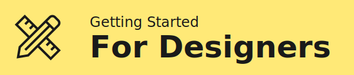

import headerImgURL from "../static/header.jpg";
import LargeParagraph from "../src/components/LargeParagraph";
import Image from "../src/components/Image";
import Link from "../src/components/Link";

# Helsinki Design System

<LargeParagraph>
    The open-source design system for digital products and experiences with the City of Helsinki Design Language at its heart. The Helsinki Design System is focused on usability and accessibility and aims to improve the quality and consistency of City of Helsinki digital services – making the user experience better for everyone.
</LargeParagraph>

_**All content is available under CC BY 4.0, except where otherwise stated.** The City of Helsinki logo is a registered trademark. The Helsinki Grotesk Typeface is a proprietary typeface licensed by Camelot Typefaces._
