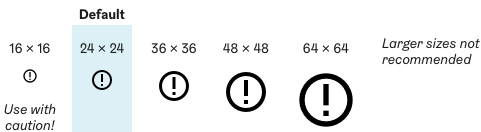

import LargeParagraph from "../../src/components/LargeParagraph";
import * as HDS from "hds-react";

# Icons

<LargeParagraph>
    The HDS icon library is a set of icons specially designed for use in digital user interfaces. 
</LargeParagraph>

> **Work in progress!**
> 
> Possible upcoming changes to brand guidelines due to accessibility improvements. These can also affect design principles and visual style of icons.

**The HDS icon library** follows the icon style defined in the Helsinki city brand guidelines, but the forms of the icons are simplified and adjusted for legibility in smaller sizes and pixel resolutions. Some icons have been added to the icon library additionally to the ones defined in the brand work, to make it easier to create easily understandable user interfaces.

## Principles
Icons are used for higlighting and providing visual cues for action, denoting types of information in e.g. forms, or giving additional meaning to content.
- **Icons should always serve a distinct, easily understandable purpose.** Icons should not be used solely for decoration.
- **Icons shoud preferably be accompanied with a text label to give context for interpretation.** The meaning of icons by them self can be ambiguous and change depending on the context. Label can be omitted only if the meaning of the icon is be easilly interpreted from the context, e.g. volume buttons in vido playback.

## Accessibility
- The colour contrast between the icon and its background must comply with [AA Level contrast ratios](https://www.w3.org/TR/WCAG20/#visual-audio-contrast "WCAG 2.0 Visual and audio contrast").

## Usage
### Size
The default size of the HDS icons is 24 × 24 px.
- If needed, other sizes matching the HDS layout spacing can also be used.
- When using the icons in 16 × 16 px, make sure the icon is still clear and legible.
- Larger sizes than 64 × 64 px are not recommended

### Colour
The default colour of the HDS icons is black or white, depending on the background. 
- Other colours should be used sparingly and serve a clear purpose, preferably only highlighting error and other system status.
- See [colour guidelines](/design-tokens/colour "Colour") for further information.

## Variations
The HDS icon library is categorized into four types of icons designed to be used for different purposes:
1. **UI icons** are mainly intented for providing visual cues for interaction, increasing discoverability and learnability. The UI icons can be used for example in buttons or navigation. Using UI icons for purely decorative purposes and illustration should be avoided.
2. **Illustrative icons** are more decorative and playful. They are intented for illustrating concepts and services.
3. **Pictograms** are more complex icon styled pictures for illustrating concepts, services and processes.
4. **SoMe icons** are logos of Helsinki city social media channels and digital services as ways of logging in. 

### UI Icons		
#### Arrows and operators		
Icon	                    | Name              | Usage
--------------------------- | ----------------- | ---------------------------------------------
<HDS.IconAngleDown />       | AngleDown	        | Dropdown
<HDS.IconAngleLeft />       | AngleLeft	        |
<HDS.IconAngleRight />      | AngleRight        |
<HDS.IconAngleUp />         | AngleUp           | Dropdown
<HDS.IconArrowDown />       | ArrowDown         |
<HDS.IconArrowLeft />       | ArrowLeft	        |
<HDS.IconArrowRight />      | ArrowRight	    |
<HDS.IconArrowUp />         | ArrowUp	        |
<HDS.IconCheck />           | Check	            |
<HDS.IconCross />           | Cross	            | Close
<HDS.IconCrossCircle />     | CrossCircle	    |
<HDS.IconMinus />           | Minus	            |
<HDS.IconMinusCircle />     | MinusCircle	    |
<HDS.IconPlus />            | Plus	            | Add
<HDS.IconPlusCircle />      | PlusCircle	    |

#### Notifications and expressions
Icon	                    | Name              | Usage
--------------------------- | ----------------- | ---------------------------------------------
<HDS.IconAlertCircle />     | AlertCircle       | Alert
<HDS.IconInfoCircle />      | InfoCircle        | Information
<HDS.IconError />           | Error             | Error
<HDS.IconFaceNeutral />     | FaceNeutral       |
<HDS.IconFaceSad />         | FaceSad           |
<HDS.IconFaceSmile />       | FaceSmile         | Success notification
<HDS.IconHeart />           | Heart             | Like
<HDS.IconHeartFill />       | HeartFill         | Like selected
<HDS.IconQuestionCircle />  | QuestionCircle    | Help, Tooltip
<HDS.IconStar />            | Star              | Rating
<HDS.IconStarFill />        | StarFill          | Rating selected

#### Navigation
Icon	                    | Name              | Usage
--------------------------- | ----------------- | ---------------------------------------------
<HDS.IconHome />            | Home              | Home
<HDS.IconHomeSmoke />       | HomeSmoke         |
<HDS.IconMenuHamburger />   | MenuHamburger     | Mobile menu
<HDS.IconMenuDots />        | MenuDots          | Additional operations
<HDS.IconSignin />          | Signin            | Sign in
<HDS.IconSignout />         | Signout           | Sign out
<HDS.IconSearch />          | Search            | Search
<HDS.IconUser />            | User              | Username

#### Actions and settings
Icon	                    | Name              | Usage
--------------------------- | ----------------- | ---------------------------------------------
<HDS.IconBell />            | Bell              | Notification
<HDS.IconBellCrossed />     | BellCrossed       | Disable notifications
<HDS.IconCogwheel />        | Cogwheel          | Settings
<HDS.IconDownload />        | Download          | Download file to device
<HDS.IconDownloadCloud />   | DownloadCloud     | Download from cloud service
<HDS.IconEye />             | Eye               | Show content
<HDS.IconEyeCrossed />      | EyeCrossed        | Hide content
<HDS.IconLock />            | Lock              | Content locked
<HDS.IconLockOpen />        | LockOpen          | Content unlocked
<HDS.IconShare />           | Share             | Share content or link
<HDS.IconUpload />          | Upload            | Upload file to server
<HDS.IconUploadCloud />     | UploadCloud       | Upload to cloud service
<HDS.IconZoomIn />          | ZoomIn            | Increase zoom level
<HDS.IconZoomOut />         | ZoomOut           | Decrease zoom level
<HDS.IconZoomText />        | ZoomText          | Text zoom settings

#### Forms and data
Icon	                    | Name              | Usage
--------------------------- | ----------------- | ---------------------------------------------
<HDS.IconArrowRedo />       | ArrowRedo         | Redo edits
<HDS.IconArrowUndo />       | ArrowUndo         | Undo edits
<HDS.IconCalendar />        | Calendar          | Date
<HDS.IconCalendarClock />   | CalendarClock     | Date and time
<HDS.IconCalendarCross />   | CalendarCross     | Remove date
<HDS.IconCalendarPlus />    | CalendarPlus      | Add date
<HDS.IconClock />           | Clock             | Time
<HDS.IconClockCross />      | ClockCross        | Remove time
<HDS.IconClockPlus />       | ClockPlus         | Add time
<HDS.IconGlobe />           | Globe             | Web page address
<HDS.IconGroup />           | Group             | Group
<HDS.IconEnvelope />        | Envelope          | Email address / message
<HDS.IconLink />            | Link              |                                               
<HDS.IconLinkExternal />    | LinkExternal      | Link to another website / opens in other tab
<HDS.IconLocate />          | Locate            | Show users location
<HDS.IconLocation />        | Location          | Location
<HDS.IconMap />             | Map               | Map
<HDS.IconPaperclip />       | Paperclip         | Attachment
<HDS.IconPen />             | Pen               | Edit content
<HDS.IconPenLine />         | PenLine           | Fill content
<HDS.IconPersonFemale />    | PersonFemale      | Gender female
<HDS.IconPersonMale />      | PersonMale        | Gender male
<HDS.IconPersonWheelchair />| PersonWheelchair  | Accessibility
<HDS.IconPhone />           | Phone             | Phone number
<HDS.IconPhoto />           | Photo             | Photo or image file
<HDS.IconPhotoPlus />       | PhotoPlus         | Add photo or image file
<HDS.IconSpeechbubble />    | Speechbubble      | Chat / comment
<HDS.IconSpeechbubbleText />| SpeechbubbleText  | Chat / comment
<HDS.IconTrash />           | Trash             | Trash

#### Media and devices
Icon	                        | Name                  | Usage
------------------------------- | --------------------- | ---------------------------------------------
<HDS.IconCamera />              | Camera                | Take photo
<HDS.IconDisplay />             | Display               | Display / desktop version
<HDS.IconMicrophone />          | Microphone            | Microphone / sound recording
<HDS.IconMicrophoneCrossed />   | MicrophoneCrossed     | Microphone disabled
<HDS.IconMobile />              | Mobile                | Mobile device / version
<HDS.IconVolumeHigh />          | VolumeHigh            | Volume level set to high
<HDS.IconVolumeLow />           | VolumeLow             | Volume level set to low
<HDS.IconVolumeMinus />         | VolumeMinus           | Decrease volume level
<HDS.IconVolumeMute />          | VolumeMute	        | Mute volume / volume level set to mute
<HDS.IconVolumePlus />          | VolumePlus            | Increase volume level
<HDS.IconVideocamera />         | Videocamera           | Video
<HDS.IconVideocameraCrossed />  | VideocameraCrossed    | Video disabled
<HDS.IconWifi />                | Wifi                  | Wifi connection
<HDS.IconWifiCrossed />         | WifiCrossed           | No wifi connection

#### Other
Icon	                        | Name                  | Usage
------------------------------- | --------------------- | ---------------------------------------------
<HDS.IconTicket />	            | Ticket                |

### Illustrative icons
> Coming soon!

### Pictograms
> Coming soon!

### SoMe Icons
Icon	                        | Name                  | Usage
------------------------------- | --------------------- | ---------------------------------------------
<HDS.IconDiscord />             | Discord               |
<HDS.IconFacebook />            | Facebook              |
<HDS.IconGoogle />              | Google                | Google account login
<HDS.IconInstagram />           | Instagram             |
<HDS.IconLinkedin />            | Linkedin              |
<HDS.IconSnapchat />            | Snapchat              |
<HDS.IconTiktok />              | Tiktok                |
<HDS.IconTwitch />              | Twitch                |
<HDS.IconTwitter />             | Twitter               |
<HDS.IconVimeo />               | Vimeo                 |
<HDS.IconYle />                 | Yle                   | Yle-tunnus account 
<HDS.IconYoutube />             | Youtube               |